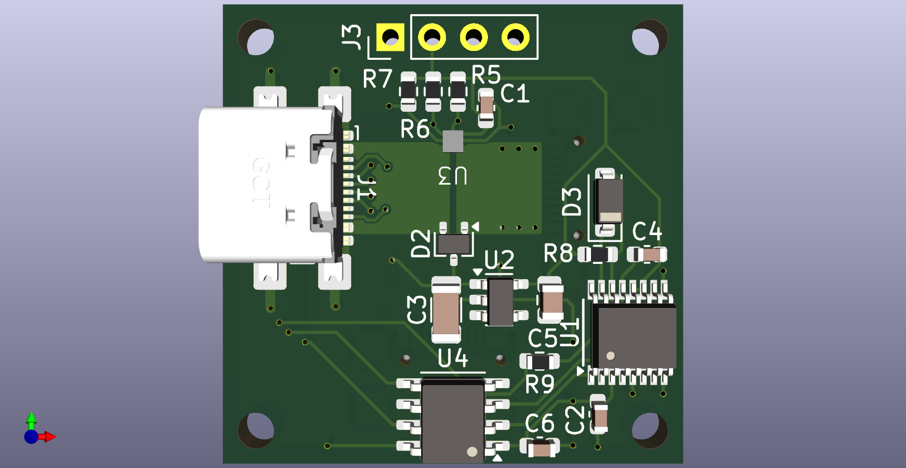
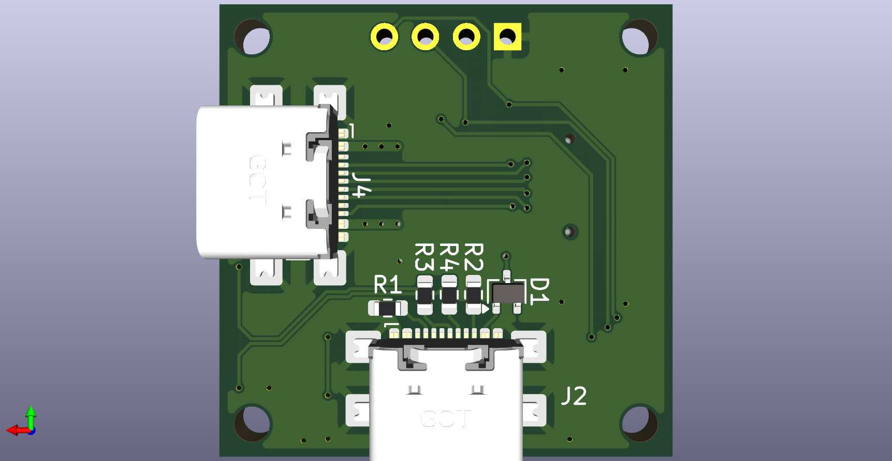

# The USB-C Power Meter
This project is an open-source power meter over USB-C and compliant with USB Power Delivery 3.0.

## Current Status
- Still under development.

## Hardware
- Acquisition is made trough INA700 with an integrated shunt.
- Acquisition board use a SSD1306-based I2C OLED Module to display data.

## Software
- Still under development.
